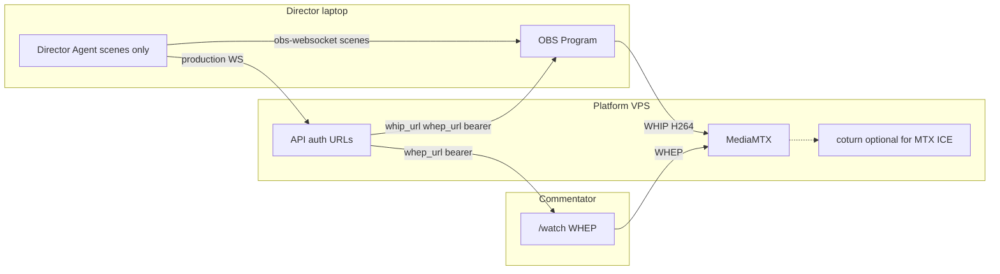

# OBS WHIP → MediaMTX → WHEP (вместо FFmpeg)

## Решение (канон)

**MediaMTX крутится на Platform** (Docker profile рядом с coturn), не на ноуте режиссёра.

- OBS (ноут режиссёра) публикует **WHIP** на MediaMTX
- Комментатор `/watch` читает **WHEP** из MediaMTX
- Director Agent **не** кодирует видео (нет FFmpeg / `--live-webrtc`)
- Agent по-прежнему: OBS WebSocket (сцены) + agent WS к Platform
- **CI / Fake:** старый Pion `--fake-webrtc` + signaling **остаётся** (verify без OBS и без MediaMTX)

Это **меняет frozen** [WEBRTC-CONTRACT.md](docs/WEBRTC-CONTRACT.md) F2 / [ADR-022](docs/DECISIONS.md) («P2P, без SFU») **только для live-пути**. Медиа теперь идёт через VPS — осознанный trade-off ради качества и задержки. Источник картинки по-прежнему ноут режиссёра (OBS), не запись матча с VPS.

## Почему так

| Было (TZ008)                   | Станет                                     |
| ------------------------------ | ------------------------------------------ |
| VC → FFmpeg → VP8 → Pion → P2P | OBS native WHIP → MediaMTX → WHEP          |
| Двойной encode, буферы dshow   | Один encode в OBS (обычно H264)            |
| Нагрузка на CPU режиссёра      | Encode в OBS, раздача на VPS               |
| Signaling protocol 1           | Live: WHEP; Fake: protocol 1 без изменений |

## Поток для людей

1. Организатор поднимает матч, открывает пульт / staff links
2. Platform выдаёт **WHIP URL + bearer** (короткоживущий) для этого `matchId`
3. Режиссёр в OBS: Service = WHIP, Server = URL, Bearer = token → Start Streaming (**отдельный выход** от Twitch RTMP; Twitch по-прежнему Stream Delay)
4. Agent только переключает сцены
5. Комментатор: `/watch?token=…` → Platform отдаёт **WHEP URL + bearer** → браузер WHEP → видео

Twitch и WHIP — **два выхода** OBS (если OBS версии не даёт оба сразу — WHIP через вторую инстанцию/`obs-websocket` plugin или Custom output; зафиксировать в доке после spike на машине @owner).

## Техника

### 1. MediaMTX (infra)

- Новый сервис в compose, profile например `whip` (или расширить `webrtc`): образ `bluenviron/mediamtx`, порт **8889** (WebRTC/WHIP/WHEP)
- Конфиг `infra/mediamtx/mediamtx.yml`:
  - path pattern: `stk/~` или `stk/{matchId}`
  - auth: JWT или internal users + **bearer на publish/read**
  - ICE: встроить существующий coturn (`TURN_*`) в `webrtcICEServers2`
- Health: `GET MediaMTX /v3/...` или TCP check в `verify` только если profile поднят
- Env (`.env.example`): `MEDIAMTX_PUBLIC_URL`, `MEDIAMTX_API`, секреты JWT/bearer **не в git**

### 2. Platform API (выдача URL)

Новые (или расширение turn-роутера) endpoints, auth как у TURN:

| Кто                        | Endpoint                                                  | Ответ                                    |
| -------------------------- | --------------------------------------------------------- | ---------------------------------------- |
| Organizer / director panel | `POST …/matches/{id}/whip-publish`                        | `{ whip_url, bearer, expires_at, path }` |
| Commentator invite         | `POST …/matches/{id}/whep-play` (cap `commentator.watch`) | `{ whep_url, bearer, expires_at }`       |

- Path канон: `stk/<matchId>` →  
`https://<MEDIAMTX_PUBLIC>/stk/<matchId>/whip` и `…/whep`
- Bearer: HMAC/JWT с TTL ~5–15 мин, refresh с панели; **не** класть agent token в OBS
- Лимит комментаторов: как сейчас **≤2** — считать активные WHEP-сессии на Platform (таблица/in-memory) или ограничить выдачу credentials; MediaMTX сам «max 2» не знает
- Production/health: опционально `broadcast_status` / компонент `whip: connected|waiting` через MediaMTX API `paths/list` (есть ли publisher на path)

Файлы-ориентиры: [apps/api/app/presentation/http/routers/turn.py](apps/api/app/presentation/http/routers/turn.py), invite caps, [docs/WEBRTC-CONTRACT.md](docs/WEBRTC-CONTRACT.md).

### 3. Overlay `/watch` (клиент)

- Режим **live WHIP-era:** вместо [signalingSubscriber.ts](apps/overlay/src/lib/signalingSubscriber.ts) — WHEP client (`RTCPeerConnection` + HTTP POST SDP на `/whep`, стандартный минимальный клиент или тонкая обёртка)
- Режим **fake/CI:** оставить текущий signaling + `--fake-webrtc` (флаг/`?mock=1` / ответ API `media: { mode: "whep"|"fake"|"mock" }`)
- UI статусы: «нет эфира» если WHEP 404/нет publisher (режиссёр не нажал Start Streaming в OBS)

### 4. Director Agent

- **Убрать из live-канона:** `--live-webrtc`, FFmpeg capture, Virtual Cam requirement для комментаторов
- Оставить: `--fake-obs` / real OBS, `--fake-webrtc` только для локальной проверки старого пути или deprecate later
- Скрипты [live-cs2-local.ps1](scripts/live-cs2-local.ps1) / [dev-remote.ps1](scripts/dev-remote.ps1): не стартовать live-webrtc; печатать WHIP URL из API после login
- Шаблоны OBS: [apps/director-agent/templates/](apps/director-agent/templates/) — инструкция WHIP output + checklist

### 5. Документы / ADR

- **ADR-0xx** (новый): «Комментаторы: OBS WHIP + MediaMTX + WHEP»; supersede ADR-022 **для live**; ADR-008 уточнить («источник = ноут», но media-relay на Platform допустим)
- Обновить: [WEBRTC-CONTRACT.md](docs/WEBRTC-CONTRACT.md) (protocol **2** live WHEP; protocol 1 fake), [TECH-STACK.md](docs/TECH-STACK.md) §4.1, [ARCHITECTURE.md](docs/ARCHITECTURE.md), [ALPHA-LIVE-TRACKS.md](docs/ALPHA-LIVE-TRACKS.md), [docs/alpha/director.md](docs/alpha/director.md), [BROADCAST-DELAY.md](docs/BROADCAST-DELAY.md) (Twitch delay ≠ WHIP)
- Новое ТЗ **TZ010** (или reopen people optional): scope, frozen, DoD, owner smoke

## Границы (не в этом ТЗ)

- Аудио WebRTC (по-прежнему Discord/Voicemeeter)
- Замена Twitch на WHIP
- LiveKit Cloud / платный SaaS
- Удаление Fake/Pion в первом релизе (только после стабилизации WHIP)
- Запись/DVR MediaMTX

## Риски и spike (P0 до большой волны)

1. **OBS: WHIP + Twitch одновременно** — проверить на машине @owner (версия OBS). Если нельзя — докум. «WHIP = Custom/второй процесс» или приоритет WHIP на матч без Twitch.
2. **NAT/ICE MediaMTX ↔ домашний OBS** — нужен корректный `webrtcAdditionalHosts` / публичный IP VPS + coturn.
3. **HTTPS:** для production WHIP/WHEP лучше TLS (или тот же reverse-proxy что API); localhost smoke — HTTP ok.
4. **Bearer в OBS** — не логировать в WORKLOG/чат.

## Порядок внедрения (волна)

| Шаг | Что                                                                          |
| --- | ---------------------------------------------------------------------------- |
| P0  | Spike: MediaMTX docker local + OBS WHIP + статическая whep.html; ICE на VPS  |
| P1  | ADR + контракт protocol 2 + compose/env schema                               |
| P2  | API whip-publish / whep-play + auth + лимит 2                                |
| P3  | `/watch` WHEP client + fallback fake/mock                                    |
| P4  | Доки режиссёра, скрипты без FFmpeg live, health «publisher online»           |
| P5  | verify: Fake path зелёный; WHIP profile — smoke/optional                     |
| P6  | @owner smoke → `live_webrtc` трек переименовать/заменить на `live_whip=done` |

## Критерии готовности

- [ ] Комментатор видит Program OBS через `/watch` **без FFmpeg и без Virtual Cam**
- [ ] Задержка и качество заметно лучше текущего live-webrtc (субъективно @owner + нет «картошки» от двойного VP8)
- [ ] Fake/`verify.ps1` без MediaMTX — зелёный
- [ ] Секреты WHIP/WHEP не в git; Twitch Stream Delay не влияет на WHIP
- [ ] ADR + WEBRTC-CONTRACT обновлены; Agent live-ffmpeg path помечен deprecated