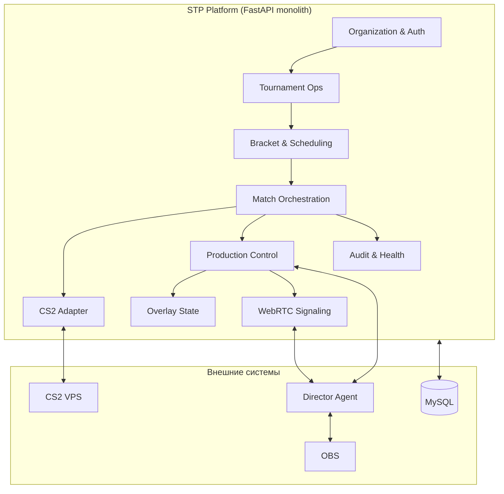
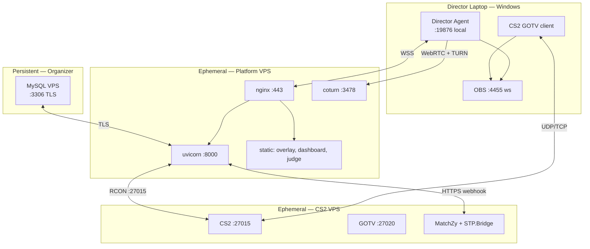
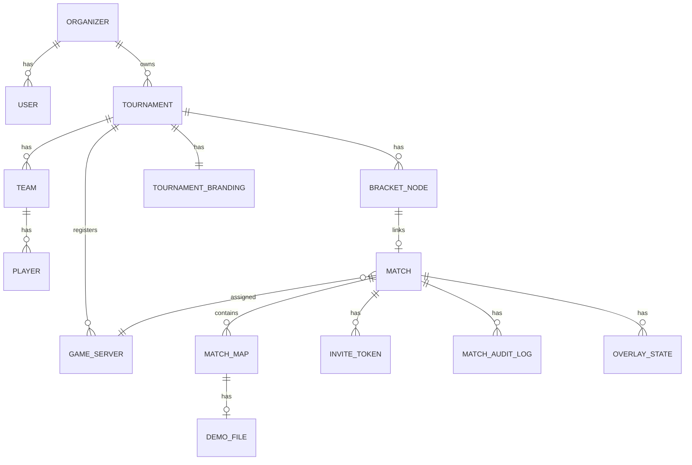
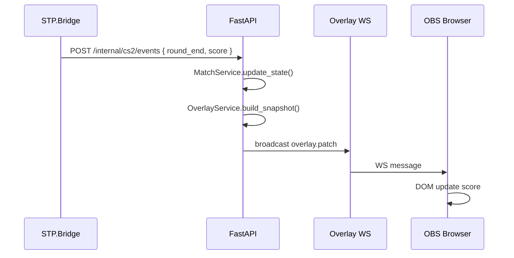
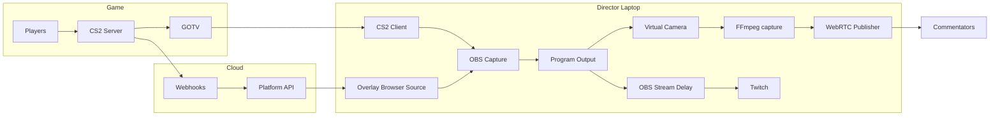
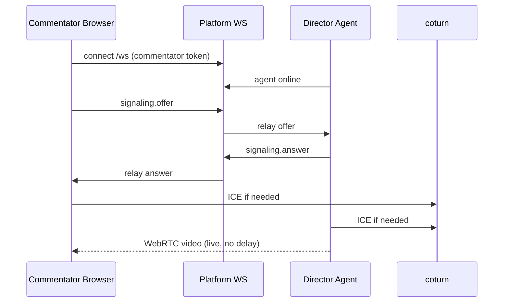

# Student Tournament Platform — архитектура платформы

> Версия **2.1** · 2026-08-11  
> Источники: [VISION.md](VISION.md) · [TECH-STACK.md](TECH-STACK.md) · [DECISIONS.md](DECISIONS.md) · **[INVARIANTS.md](INVARIANTS.md)**  
> Краткий обзор: [overview/architecture.md](../overview/architecture.md)  
> **Домены и слои:** [LAYERS.md](LAYERS.md)

**Формула runtime:** Events = скорость · State = истина · Snapshots = recovery · Reconciliation = correctness.  
**Тип системы:** modular monolith with distributed execution boundaries and state reconciliation.

---

## Содержание

1. [Резюме](#1-резюме)
2. [Принципы и ограничения](#2-принципы-и-ограничения)
3. [Логическая архитектура](#3-логическая-архитектура)
4. [Физическая и сетевая топология](#4-физическая-и-сетевая-топология)
5. [Процессы runtime](#5-процессы-runtime)
6. [Структура монорепозитория](#6-структура-монорепозитория)
7. [Компоненты платформы](#7-компоненты-платформы)
8. [Модель данных](#8-модель-данных)
9. [API и real-time](#9-api-и-real-time)
10. [Машины состояний](#10-машины-состояний)
11. [Интеграция CS2](#11-интеграция-cs2)
12. [Production pipeline](#12-production-pipeline)
13. [WebRTC и комментаторы](#13-webrtc-и-комментаторы)
14. [OBS и overlay](#14-obs-и-overlay)
15. [Безопасность](#15-безопасность)
16. [Отказоустойчивость](#16-отказоустойчивость)
17. [Наблюдаемость](#17-наблюдаемость)
18. [Будущее расширение](#18-будущее-расширение)

**См. также:** [LAYERS.md](LAYERS.md) — девять доменов, четыре слоя, структура `apps/api/`.

---

## 1. Резюме

**Student Tournament Platform (STP)** — система для проведения **дистанционных CS2-турниров** с полупрофессиональной трансляцией. Архитектура **распределённая по ролям инфраструктуры**, но **не микросервисная**: на Platform VPS один backend-процесс (FastAPI), фронтенды — static SPA.

### Три зоны ответственности

| Зона | Где | Ответственность |
|------|-----|-----------------|
| **Control plane** | Platform VPS + MySQL | Турниры, матчи, auth, overlay data, signaling, audit |
| **Game plane** | CS2 VPS | Игровой матч, MatchZy, демо, RCON |
| **Production plane** | Ноутбук режиссёра | OBS, CS2 spectator, WebRTC, delayed Twitch |

**Золотое правило:** game plane **автономен** — падение control/production plane не убивает матч на сервере.

### Ключевые потоки

```text
Игроки ──► CS2 VPS ◄── webhooks ── Platform API ──► MySQL
                              ▲              │
                              │              ├── WebSocket ──► Overlay / Dashboard / Judge
Ноутбук режиссёра ────────────┘              │
  (GOTV + OBS + Agent) ◄── WS / commands ────┘
       │
       ├── WebRTC (live) ──► Комментаторы (browser)
       └── RTMP delayed ──► Twitch
```

---

## 2. Принципы и ограничения

| # | Принцип | Следствие в архитектуре |
|---|---------|-------------------------|
| P1 | Матч важнее всего | CS2 VPS не зависит от Platform uptime mid-round |
| P2 | Эфир должен восстанавливаться | Director Agent + OBS templates; overlay деградирует gracefully |
| P3 | Один ноутбук режиссёра | CS2 + OBS + Agent на одном хосте; минимум RAM/CPU |
| P4 | Не микросервисы | Один API process; in-memory WS fanout |
| P5 | CS2-only | Адаптер `cs2/` без plugin SDK |
| P6 | Reuse MatchZy | Свой код только в STP.Bridge + thin adapter |
| P7 | MySQL = durable SoT for **platform-owned** state | Не «единственный source of truth» для score/OBS; см. [INVARIANTS.md](INVARIANTS.md) |
| P8 | Secrets не в браузере | RCON, OBS password — server/agent only |
| P9 | Desired ≠ actual until observed | Commands set intent; runtimes report actual; reconcile |
| P10 | Single API replica (v1) | In-memory WS; Redis only if replicas > 1 |

### Scope v1

**Включено:** tournament ops, CS2 adapter, director/judge/commentator UX, overlay, bracket, health, GOTV metadata.  
**Исключено:** BestTvGU UI, public website, player stream ingest, Twitch API, multi-game, Redis, K8s.

---

## 3. Логическая архитектура

Платформа разбита на **bounded contexts** (модули в одном deployable, не отдельные сервисы).



### Контексты и владение данными

| Context | Владеет | Публикует события |
|---------|---------|-------------------|
| **Organization & Auth** | users, roles, invite_tokens, instance_settings | `user.created` |
| **Tournament Ops** | tournaments, teams, players, branding BLOBs | `tournament.published`, `tournament.completed` |
| **Bracket & Scheduling** | bracket_nodes, match_schedule | `bracket.updated` |
| **Match Orchestration** | matches, maps, match_state, game_servers | `match.state_changed` |
| **CS2 Adapter** | server_credentials, webhook ingest, RCON pool | `game.*` (internal) |
| **Production Control** | production_sessions, obs_templates, scene_state | `production.scene_changed` |
| **Overlay State** | overlay_snapshot, manual_overrides | `overlay.updated` |
| **WebRTC Signaling** | peer sessions, ICE relay config | signaling only |
| **Audit & Health** | match_audit_log, component_heartbeats | `health.degraded` |

**Межмодульное взаимодействие:** синхронные вызовы service layer внутри процесса + internal event bus (Python async callbacks / простой pub-sub в памяти). Без message broker в v1.

---

## 4. Физическая и сетевая топология

### 4.1 Диаграмма развёртывания



### 4.2 Порты и firewall

| Хост | Порт | Протокол | Кто подключается |
|------|------|----------|------------------|
| Platform VPS | 443 | HTTPS/WSS | Все клиенты |
| Platform VPS | 3478 | UDP/TCP TURN | Commentators, Agent |
| MySQL VPS | 3306 | MySQL TLS | Platform VPS IP only |
| CS2 VPS | 27015 | UDP/TCP | Игроки |
| CS2 VPS | 27020 | UDP | GOTV (режиссёр) |
| CS2 VPS | 443 outbound | HTTPS | Webhooks → Platform |
| Director laptop | 4455 | WS localhost | Agent → OBS |
| Director laptop | 19876 | HTTP localhost | Setup wizard (optional) |

### 4.3 Модель инстанса организатора

```text
Organizer Instance
├── MySQL (permanent)           — все турниры организатора
├── Platform VPS (per tournament event or shared) — stateless app
├── CS2 VPS (per match or per tournament day)     — ephemeral
└── Director laptops (N)        — Agent per broadcast
```

Один организатор может вести **много параллельных турниров** в одной MySQL. Platform VPS может быть **один на все активные турниры** организатора (рекомендация v1) или отдельный на крупный ивент.

---

## 5. Процессы runtime

| Процесс | Хост | Язык | Обязателен для матча |
|---------|------|------|----------------------|
| `stp-api` | Platform VPS | Python | Да (control) |
| `nginx` | Platform VPS | — | Да |
| `coturn` | Platform VPS | C | Да (удалённые комментаторы) |
| `cs2` + plugins | CS2 VPS | — | **Критичен** |
| `stp-director-agent` | Director laptop | Go | Да (production) |
| `obs64` | Director laptop | — | Да (broadcast + Stream Delay) |
| `cs2.exe` (spectator) | Director laptop | — | Да (картинка) |
| `ffmpeg` (WebRTC capture) | Director laptop | — | Да (live комментаторам; не delay) |
| `ffmpeg` (Twitch delay) | Director laptop | — | **Нет в v1** — только fallback v2 |

### Жизненный цикл процессов на турнир

```text
T-7d   MySQL уже работает
T-1d   deploy Platform VPS, migrate DB
T-4h   create tournament, teams, bracket in UI
T-2h   deploy CS2 VPS, register server
T-1h   director: Agent setup, OBS template import
T-0    match: start → live → end → optional teardown CS2 VPS
T+7d   optional: teardown Platform VPS (MySQL остаётся)
```

---

## 6. Структура монорепозитория

```text
BestCSTournaments/
├── apps/
│   ├── api/                    # FastAPI backend (control plane)
│   ├── overlay/                # Svelte+Vite — OBS Browser Source + /watch
│   ├── dashboard/              # SvelteKit — organizer + director
│   ├── judge/                  # SvelteKit — mobile judge (или routes в dashboard)
│   └── director-agent/         # Go — OBS + WebRTC (+ FFmpeg capture; delay = v2)
├── infra/
│   ├── platform/
│   │   ├── docker-compose.yml
│   │   ├── nginx/
│   │   └── coturn/
│   └── game-server/
│       ├── plugins/STP.Bridge/
│       ├── matchzy-config/
│       └── systemd/
├── scripts/
│   ├── deploy-platform.sh
│   ├── deploy-cs2.sh
│   └── verify.ps1
├── packages/                   # optional shared TS types
│   └── api-types/
├── docs/
├── overview/
└── workers/
```

### Зависимости между артефактами

```text
apps/api          ←── webhooks ── STP.Bridge (CS2)
apps/dashboard    ──REST/WS──► apps/api
apps/overlay      ──WS───────► apps/api
apps/judge        ──REST/WS──► apps/api
director-agent    ──WS───────► apps/api
director-agent    ──WS───────► OBS (local)
nginx             ──static────► overlay, dashboard, judge builds
```

---

## 7. Компоненты платформы

### 7.1 API (`apps/api/`)

Единый **control plane**. Слои внутри:

```text
HTTP/WS Edge (routers)
    ↓
Application Services (use cases)
    ↓
Domain Models + State Machines
    ↓
Repositories (SQLAlchemy)
    ↓
Adapters (CS2, storage)
```

**Ключевые сервисы:**

| Service | Ответственность |
|---------|-----------------|
| `AuthService` | JWT, invite tokens, session validation |
| `TournamentService` | CRUD турниров, publish, branding |
| `TeamService` | Команды, состав 5+coach |
| `BracketService` | Single elim nodes, manual links, advance winner |
| `MatchService` | Match lifecycle, map series BO1/3/5 |
| `GameServerService` | Register CS2 VPS, health, credentials |
| `CS2AdapterService` | Webhook ingest, RCON commands, state sync |
| `ProductionService` | Director session, OBS scene commands queue |
| `OverlayService` | Merge game state + manual overrides → snapshot |
| `JudgeService` | Review request / resolve workflow |
| `SignalingService` | WebRTC offer/answer/ICE relay |
| `AuditService` | Append-only match log |
| `HealthService` | Aggregate heartbeats |

### 7.2 Dashboard (`apps/dashboard/`)

| Раздел | Роль | Функции |
|--------|------|---------|
| `/admin` | Organizer | Турниры, команды, сетка, расписание, инвайты |
| `/director/[matchId]` | Director | Сцены OBS, overlay override, match control, health |
| `/settings` | Organizer | Branding upload, delay seconds (чек-лист OBS), OBS template |

**Связь с Agent:** dashboard не говорит с OBS напрямую — только через API → Agent command queue.

### 7.3 Overlay (`apps/overlay/`)

Два режима в одном SPA:

| Route | Потребитель | Режим |
|-------|-------------|-------|
| `/overlay/[matchId]` | OBS Browser Source | Read-only WS + render scenes |
| `/watch/[token]` | Commentator | WS + WebRTC player |

**Scene renderer:** один Svelte app переключает layouts по `overlay_state.scene` (intro, teams, ingame, break, winner, waiting, replay).

### 7.4 Judge (`apps/judge/`)

Mobile-first PWA route. Минимум UI:

- Большая кнопка «Запрос проверки» / «Отменить запрос»
- Статус: ожидание раунда / пауза / решение
- Кнопки: «Тех. поражение» / «Продолжить матч»

### 7.5 Director Agent (`apps/director-agent/`)

```text
┌─────────────────────────────────────────────┐
│              Director Agent (Go)             │
├─────────────────────────────────────────────┤
│ PlatformClient   │ WS to STP, auth, commands │
│ OBSSession       │ obs-websocket v5          │
│ CapturePipeline  │ OBS Virtual Cam → FFmpeg  │
│ WebRTCPublisher  │ Pion → commentators       │
│ StateReconciler  │ desired ↔ OBS actual      │
│ FFmpegDelay      │ v2 only — Twitch fallback │
│ ImperativeCmds   │ refresh BS, etc.          │
│ HealthReporter   │ ping + versions every 10s │
└─────────────────────────────────────────────┘
```

**Twitch delay (v1):** не Agent — **OBS Stream Delay** на stream output. Virtual Camera / WebRTC остаются без задержки.

**Agent protocol:** whitelist only (`obs.set_scene`, …). Machine identity: long-lived agent credential + short-lived session; revocable. `agent_version` + `protocol_version` в handshake.
**Command flow:**

```text
Director UI → API: POST /matches/{id}/production/scene { scene: "intro" }
API → WS → Agent: { type: "obs.set_scene", scene: "STP_Intro" }
Agent → OBS: SetCurrentProgramScene
Agent → API: { type: "obs.ack", ok: true }
API → WS → Dashboard: scene confirmed
```

### 7.6 CS2 VPS stack

```text
cs2 dedicated server
└── metamod
    └── counterstrikesharp
        ├── matchzy          # match flow, ready, knife, demos
        └── stp.bridge       # webhooks, judge pause hook, heartbeat
```

---

## 8. Модель данных

### 8.1 ER-диаграмма (ядро)



### 8.2 Таблицы (основные)

| Таблица | Назначение | Ключевые поля |
|---------|------------|---------------|
| `organizers` | Инстанс | `id`, `name` (connection — deployment config, не обязательно `mysql_ref` в business DB) |
| `users` | Организаторы | `email`, `password_hash`, `role` |
| `tournaments` | Турнир | `status`, `format`, `configured_broadcast_delay_seconds`, `settings_json` |
| `tournament_branding` | BLOB медиа | `logo_blob`, `bg_blob`, `colors_json` (limits: logo ≤2MB, bg ≤5MB) |
| `teams` | Команда | `tournament_id`, `name`, `tag` |
| `players` | Игрок | `team_id`, `nickname`, `steam_id`, `is_coach` |
| `bracket_nodes` | Узел сетки | `round`, `position`, sources / `match_id` (immutable ref) |
| `matches` | Матч | `status`, `review_status`, `version`, `bo_format`, `scheduled_at`, `game_server_id` |
| `match_maps` | Карта в серии | `map_name`, `status`, `score_a`, `score_b` |
| `game_servers` | CS2 VPS | `host`, `port`, `rcon_enc`, `webhook_secret`, `status`, `last_heartbeat` |
| `invite_tokens` | Инвайты | `token_hash`, `role`, `match_id`, `expires_at`, `revoked_at` |
| `overlay_states` | Текущий snapshot (1 row / match) | `scene`, `data_json`, `revision`, `updated_at` |
| `production_sessions` | Desired/actual production | `desired_scene`, `actual_scene`, `agent_status`, `obs_status`, `last_ping` |
| `event_outbox` | Durable side effects | `event_type`, `payload`, `correlation_id`, `processed_at` |
| `game_commands` | Command path | `command_id`, `type`, `status`, `ack_at` |
| `match_audit_log` | Audit | `correlation_id`, `actor_*`, `action`, `payload`, `result`, `created_at` |
| `demo_files` | Демо | `match_map_id`, `durable_uri`, `size` |
| `player_match_stats` | Статистика | `player_id`, `kills`, `deaths`, `assists` |

### 8.3 `overlay_states` — merge logic

```text
effective_overlay = merge(
  game_state,        # from CS2 adapter (authoritative for score/round)
  production_scene,  # from director (authoritative for scene)
  manual_overrides,  # from director (temporary score fix etc.)
  judge_banner       # tech_pause / review_requested
)
```

Приоритет при конфликте: `judge_banner` > `manual_overrides` (TTL) > `game_state` для счёта; `production_scene` для layout.

---

## 9. API и real-time

### 9.1 REST (публичные группы)

**Prefix:** `/api/v1`

| Group | Примеры | Auth |
|-------|---------|------|
| `/auth` | `POST /login`, `POST /refresh`, `POST /logout` | public / cookie |
| `/tournaments` | CRUD, `POST /{id}/publish` | organizer JWT |
| `/tournaments/{id}/teams` | CRUD teams, players | organizer |
| `/tournaments/{id}/bracket` | GET/PATCH nodes | organizer |
| `/matches` | CRUD, `POST /{id}/start`, `POST /{id}/complete` | organizer/director |
| `/matches/{id}/judge` | `review-request`, `review-resolve` | judge token |
| `/matches/{id}/production` | scene, override, agent-status | director token |
| `/invites` | `POST /create`, `POST /revoke` | organizer |
| `/internal/cs2` | `POST /events` (webhook) | HMAC server secret |
| `/health` | `GET /`, `GET /ready` | public |

### 9.2 WebSocket каналы

**Endpoint:** `wss://{platform}/ws`

| Channel | Subscribe | Сообщения |
|---------|-----------|-----------|
| `match:{id}:overlay` | overlay token | `overlay.patch`, `scene.change` |
| `match:{id}:dashboard` | director JWT | `match.state`, `health`, `agent.status` |
| `match:{id}:judge` | judge token | `match.state`, `pause.pending` |
| `match:{id}:commentator` | commentator token | `match.state`, `signaling.*` |
| `agent:{sessionId}` | agent cert/token | commands, signaling relay, ack |

### 9.3 Пример: game event → overlay



---

## 10. Машины состояний

> Полная формализация: [INVARIANTS.md §3](INVARIANTS.md#3-три-измерения-состояния-не-смешивать).

### 10.1 Tournament

```text
draft ──publish──► published ──► live ──complete──► completed ──► archived
  │                  │            │
  └────cancel────────┴────────────┴──► cancelled
```

### 10.2 MatchStatus (lifecycle only)

```text
scheduled → server_assigned → warmup → knife → live → map_end
                                                      ↓
                                              (next map | completed)
side: cancelled | forfeited
```

**Не** включать `tech_pause` в MatchStatus — матч остаётся `live`.

### 10.3 ReviewStatus (отдельное измерение)

```text
none → requested → pause_pending → paused → resolved (continue|forfeit)
         └─ cancelled
```

### 10.4 Production (не одна FSM)

Хранить раздельно: `agent_status`, `obs_status`, `broadcast_status`, `desired.scene` / `actual.scene`, `desired.stream` / `actual.stream`.

Agent = **reconciler** (desired → OBS), не только command executor. На reconnect — desired state, не replay команд.

### 10.5 Aggregate concurrency

`matches.version` — optimistic locking на критических transitions.
---

## 11. Интеграция CS2

### 11.1 Архитектура адаптера

```text
┌──────────── CS2 VPS ────────────┐
│  MatchZy ──events──► STP.Bridge │
│       ▲                  │      │
│       │ commands         │ HTTPS webhook
└───────┼──────────────────┼──────┘
        │                  ▼
        │         ┌─────────────────┐
        └─────────│ CS2AdapterService│
                  │  - validate HMAC │
                  │  - normalize     │
                  │  - idempotent    │
                  └────────┬─────────┘
                           ▼
                  MatchService / OverlayService
```

### 11.2 Webhook payload (нормализованный)

```json
{
  "event_id": "uuid",
  "sequence": 183,
  "server_id": "srv_abc",
  "match_id": "m_xyz",
  "type": "round_end",
  "timestamp": "2026-08-11T16:00:00Z",
  "correlation_id": "…",
  "payload": {
    "round": 12,
    "score": { "team_a": 7, "team_b": 5 },
    "map": "de_mirage"
  }
}
```

**Идемпотентность:** `event_id` UNIQUE в той же транзакции, что update match.  
**Sequence:** per match — detect gaps / out-of-order → snapshot reconciliation.  
**Handlers:** idempotent даже при dedup miss.

### 11.3 Команды Platform → CS2

Whitelist only: `LoadMatch`, `PauseMatch`, `ResumeMatch`, `ForfeitMatch`, `GetSnapshot`.  
Каждая: `command_id` → sent → ack → **actual** via event/snapshot.  
**Не** raw RCON из application. HTTP 200 ≠ applied.

| Команда | Когда |
|---------|-------|
| `LoadMatch` | Старт матча |
| `PauseMatch` | Judge tech pause (или arm на round buy) |
| `ResumeMatch` | Continue after review |
| `ForfeitMatch` | Judge forfeit |
| `GetSnapshot` | Health / reconcile / recovery |

### 11.4 Game snapshot (recovery)

Обязательный API/RCON-derived snapshot: map, round, score, phase, paused, players.  
Events = fast path; snapshot = recovery path; reconciliation loop на heartbeat/reconnect.

### 11.5 Judge pause — hook в STP.Bridge

```csharp
// Псевдологика в STP.Bridge (CounterStrikeSharp)
OnRoundStart(freeze_end: false, buy_phase: true):
  if PlatformApi.GetMatchReviewPending(matchId):
    Server.ExecuteCommand("mp_pause_match");
    PlatformApi.SendEvent("tech_pause_started", sequence++);
```

Bridge heartbeat включает `bridge_version`, `protocol_version`.
---

## 12. Production pipeline

### 12.1 Полный pipeline матча



**Delay architecture (v1):**

```text
OBS Program Output
    ├── Branch A: Virtual Camera → Agent → WebRTC (no delay) → Commentators
    └── Branch B: Stream Output + OBS Stream Delay (~90–120 s) → Twitch RTMP
```

`broadcast_delay_seconds` в настройках турнира — значение для чек-листа режиссёра (настройка OBS). Авто-применение из Agent — только в v2 (FFmpeg/SRS), см. [ADR-024](DECISIONS.md#adr-024--delayed-twitch-obs-stream-delay-v1-ffmpeg-fallback).

### 12.2 Сцены production (синхронизация OBS ↔ Overlay)

| STP scene | OBS scene name | Overlay layout |
|-----------|----------------|----------------|
| `waiting` | `STP_Waiting` | waiting.html |
| `intro` | `STP_Intro` | intro |
| `teams` | `STP_Teams` | team lineups |
| `ingame` | `STP_Ingame` | scoreboard minimal |
| `break` | `STP_Break` | break / tech pause banner |
| `replay` | `STP_Replay` | replay placeholder |
| `winner` | `STP_Winner` | winner |

Director panel: одна кнопка → API atomically sets `production_scene` + sends OBS command + pushes overlay layout.

### 12.3 OBS template generation

При publish турнира Platform генерирует `obs_collection.json`:

- Browser Source URL с match-agnostic tournament token (swap match id via Agent)
- Scenes pre-named `STP_*`
- Audio tracks documented for Voicemeeter

Agent на setup: `ImportSceneCollection` via OBS WebSocket.

---

## 13. WebRTC и комментаторы

### 13.1 Signaling flow



### 13.2 Параметры

| Параметр | Значение |
|----------|----------|
| Max commentators | 2 (архитектура допускает 3) |
| Codec | VP8 или H264 (browser compat first) |
| Bitrate target | 2–4 Mbps 720p30 |
| Audio in WebRTC | **Нет** — audio via Voicemeeter → OBS |
| TURN | coturn на Platform VPS, credentials short-lived |

### 13.3 Почему не SFU

1–2 подписчика, один publisher — **P2P + TURN** проще и дешевле mediasoup/LiveKit.

---

## 14. OBS и overlay

### 14.1 Разделение ответственности

| Слой | Кто владеет | Что показывает |
|------|-------------|----------------|
| **OBS** | Director | Композиция: игра + overlay BS + logos + transitions |
| **Overlay (web)** | Platform | Динамика: счёт, раунд, имена, tech banner, watermark |
| **Dashboard** | Director | Кнопки: не рендер, только control |

### 14.2 Overlay WebSocket protocol (v1 = full snapshot)

```json
{
  "protocol": 1,
  "type": "overlay.snapshot",
  "version": 42,
  "data": {
    "scene": "ingame",
    "team_a": { "name": "Alpha", "score": 7 },
    "team_b": { "name": "Beta", "score": 5 },
    "map": "de_mirage",
    "round": 12,
    "judge": { "status": "none" }
  }
}
```

`version` — **per match**, DB/transactional. Client на reconnect получает snapshot; patch protocol — не в v1.  
Watermark: server-enforced в render; нет флага `watermark_enabled`.

### 14.3 Latency budget

| Hop | Target |
|-----|--------|
| CS2 event → webhook | < 200 ms |
| API processing | < 50 ms |
| WS → overlay render | < 300 ms |
| **Total game → screen** | **< 1 s** |

---

## 15. Безопасность

### 15.1 Trust zones

```text
┌─────────────────────────────────────┐
│ Zone A: Public internet             │
│  - Commentators, Judge (token URL)  │
│  - Overlay (scoped token)           │
├─────────────────────────────────────┤
│ Zone B: Authenticated organizers    │
│  - JWT, HTTPS only                  │
├─────────────────────────────────────┤
│ Zone C: Internal                    │
│  - CS2 webhooks (HMAC + IP allow)   │
│  - Agent WS (session cert)          │
├─────────────────────────────────────┤
│ Zone D: Secrets                     │
│  - RCON, OBS pwd, MySQL, TURN creds │
└─────────────────────────────────────┘
```

### 15.2 Invite token design

```text
token = base64url(random 32 bytes)
store: SHA256(token) in DB
scope: { role, match_id, tournament_id, permissions[] }
TTL: match duration + 2h
revoke: organizer or auto on match complete
```

### 15.3 Webhook HMAC

```text
X-STP-Signature: sha256=hmac(secret, raw_body)
X-STP-Event-Id: uuid
```

---

## 16. Отказоустойчивость и recovery

### 16.1 Матрица деградации

| Сбой | Матч CS2 | Overlay | OBS сцены | Комментаторы | Twitch |
|------|----------|---------|-----------|--------------|--------|
| Platform API down | ✅ | ❌ freeze | ⚠️ desired retained in DB | ❌ | ⚠️ OBS stream continues if already live |
| MySQL down | ✅ | ❌ | ⚠️ | ❌ | ⚠️ |
| CS2 down | ❌ | — | — | — | — |
| Agent down | ✅ | ✅ | ❌ manual OBS | ❌ | ⚠️ |
| OBS crash | ✅ | ✅ | ❌ restart + Agent reconcile | ❌ | ❌ |
| Overlay WS drop | ✅ | reconnect → snapshot | ✅ | ✅ | ✅ |
| TURN down | ✅ | ✅ | ✅ | ❌ remote only | ✅ |

### 16.2 Recovery (система, не только человек)

| Сценарий | Действие |
|----------|----------|
| Platform restart | Load active matches → CS2 GetSnapshot → rebuild overlay → Agents get desired |
| Agent restart | Auth → desired production → query OBS → reconcile → report actual |
| Bridge restart | Heartbeat → snapshot → compare sequence → resume events |
| Duplicate / OOO webhook | event_id dedup · sequence gap → snapshot |
| Missed WS | Client reconnect → overlay.snapshot |

Полный принцип: [INVARIANTS.md](INVARIANTS.md).

### 16.3 Director manual runbook

1. **Overlay frozen:** refresh Browser Source; check Platform health  
2. **Agent disconnected:** restart agent; auto-reconcile desired scene  
3. **OBS crash:** reopen OBS; Agent reconnects and reconciles  
4. **CS2 lag:** dashboard component health (not only heartbeat)  

---

## 17. Наблюдаемость

### 17.1 Health dashboard (в director UI)

Health ≠ heartbeat. Per component: reachability · event freshness · command path · state consistency → `HEALTHY | DEGRADED | OFFLINE | UNKNOWN`.

| Компонент | Зелёный если |
|-----------|--------------|
| Platform API | `/health` OK; `/ready` DB OK |
| MySQL | ready check |
| CS2 | reachable + heartbeat + events + command ack + state sync |
| STP.Bridge | heartbeat + protocol compatible |
| Director Agent | WS + protocol compatible + desired≈actual |
| OBS | Agent reports connected; scene consistent |
| Overlay | client has recent snapshot |
| Commentators | signaling + peer (optional) |

### 17.2 Audit trail

`correlation_id`, `request_id`, `actor_type`, `actor_id`, `match_id`, `tournament_id`, `action`, `payload`, `result`, `created_at`.

Действия: `judge.review_request`, `judge.forfeit`, `director.scene_change`, `director.score_override`, `system.round_end`, `organizer.match_start`, …
---

## 18. Будущее расширение

### 18.1 BestTvGU read API (post-STP)

Отдельный router `/api/public/v1/` с API key:

- `GET /tournaments/{id}`
- `GET /tournaments/{id}/bracket`
- `GET /matches/{id}`
- `GET /matches/{id}/stats`

Rate limit + read-only. Без write.

### 18.2 Что не планируется менять архитектуру ради

- Другие игры
- Multi-tenant SaaS (сейчас instance-per-organizer)
- Kubernetes
- Замена MatchZy собственным match manager

### 18.3 Возможные эволюции (без обязательства)

| Нужда | Эволюция |
|-------|----------|
| Auto VPS | Terraform/Ansible модуль поверх тех же скриптов |
| Scale WS | Redis pub-sub между API replicas |
| Demo storage | S3-compatible вместо CS2 disk |
| LAN tournaments | Тот же stack, judge без Discord dependency |

---

## Связанные документы

| Документ | Назначение |
|----------|------------|
| [INVARIANTS.md](INVARIANTS.md) | **Инварианты A1–A12, reconciliation, SoT** |
| [VISION.md](VISION.md) | Продуктовые решения |
| [TECH-STACK.md](TECH-STACK.md) | Конкретные технологии |
| [DECISIONS.md](DECISIONS.md) | ADR (в т.ч. 025–036) |
| [LAYERS.md](LAYERS.md) | Домены и слои |
| [ROADMAP.md](ROADMAP.md) | Этапы реализации |
| [overview/code-map.md](../overview/code-map.md) | Пути в репо |

---

*Версия 2.1 — после системного ревью: desired/actual, outbox, snapshots, state dimensions. Нарушение A1–A12 = architectural bug.*
