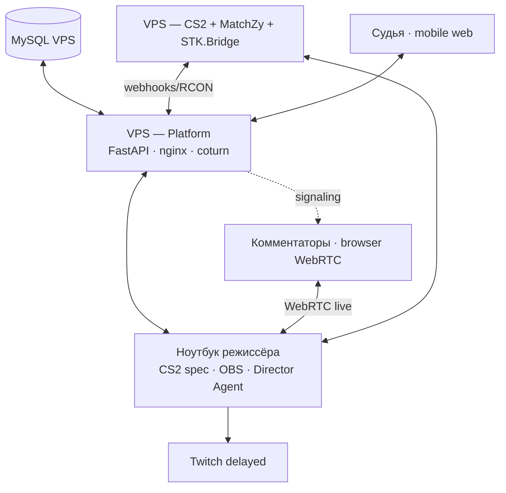

# StudentTournamentKit — архитектура (обзор)

> Полная спецификация: **[docs/ARCHITECTURE.md](../docs/ARCHITECTURE.md)** (v2.0).

---

## Три зоны системы

| Зона | Где | Задача |
|------|-----|--------|
| **Control plane** | Platform VPS + MySQL | Турниры, матчи, overlay data, auth, signaling |
| **Game plane** | CS2 VPS | Матч, MatchZy, демо, webhooks |
| **Production plane** | Ноутбук режиссёра | OBS, GOTV, WebRTC, delayed Twitch |

**Правило:** game plane автономен — падение control/production не останавливает матч.  
**Runtime:** desired/actual + snapshots + reconciliation — [INVARIANTS.md](../docs/INVARIANTS.md).

---

## Топология



---

## Логические модули (девять доменов)

> Полная раскладка: **[docs/LAYERS.md](../docs/LAYERS.md)**

```text
D1 Identity ──► D2 Tournament ──► D3 Competition ──► D4 Match (ядро)
                                                      │
                    ┌─────────────────────────────────┼──────────────────┐
                    ▼                                 ▼                  ▼
              D5 Game Integration            D6 Production        D9 Operations
                    │                                 │
                    └──────────────► D7 Overlay ◄──────┘
                                          │
                                    D8 Real-time
```

Каждый домен в backend: **Presentation → Application → Domain ← Infrastructure**.

```text
Organization & Auth ──► Tournament Ops ──► Bracket ──► Match Orchestration
                                                          │
                    ┌─────────────────────────────────────┼──────────────────┐
                    ▼                                     ▼                  ▼
              CS2 Adapter                          Production Control    Audit/Health
                    │                                     │
                    ▼                                     ├── Overlay State
              CS2 VPS                                   └── WebRTC Signaling
```

Один процесс **FastAPI** на Platform VPS; не микросервисы.

---

## Приложения

| App | Стек | Роль |
|-----|------|------|
| `apps/api/` | FastAPI | Control plane, WS, webhooks |
| `apps/dashboard/` | SvelteKit | Организатор + режиссёр |
| `apps/overlay/` | Svelte + Vite | OBS Browser Source + `/watch` |
| `apps/judge/` | SvelteKit | Судья (mobile) |
| `apps/director-agent/` | Go | OBS WS + WebRTC (+ FFmpeg capture; delay = v2) |

---

## Ключевые потоки

### Игра → Overlay

```text
STK.Bridge → webhook → API → OverlayService → WebSocket → OBS Browser Source
```

### Режиссёр → OBS

```text
Dashboard → API → WebSocket → Director Agent → obs-websocket → OBS scenes
```

### Комментаторы

```text
OBS Program → Virtual Cam → FFmpeg → Pion WebRTC → browser (live)
OBS Stream → OBS Stream Delay (~90–120 s) → Twitch
Signaling: Commentator ↔ Platform WS ↔ Agent
```

### Судья

```text
Judge UI → API → STK.Bridge → pause at next round buy → notify director + commentators
```

---

## Данные

- **MySQL** — единый source of truth (турниры, матчи, BLOB брендинга, audit)
- **CS2 VPS disk** — GOTV demos (metadata в MySQL)
- **Platform VPS** — stateless, пересоздаваемый

Подробная ER-модель: [ARCHITECTURE.md §8](../docs/ARCHITECTURE.md#8-модель-данных).

---

## Стек

| Слой | Технология |
|------|------------|
| Backend | Python 3.12 + FastAPI + SQLAlchemy 2 |
| Frontend | Svelte 5 / SvelteKit + Tailwind |
| Director Agent | Go 1.22 + Pion WebRTC + obs-websocket v5 |
| БД | MySQL 8 |
| CS2 | MatchZy + CounterStrikeSharp + STK.Bridge |
| Видео | WebRTC + coturn |
| Delay Twitch | **OBS Stream Delay** (v1); FFmpeg в Agent — fallback v2 |

[TECH-STACK.md](../docs/TECH-STACK.md) · [DECISIONS.md](../docs/DECISIONS.md)

---

## Документация

| Документ | Содержание |
|----------|------------|
| [LAYERS.md](../docs/LAYERS.md) | **Домены и слои** |
| [INVARIANTS.md](../docs/INVARIANTS.md) | **Инварианты + reconciliation (P0)** |
| [ARCHITECTURE.md](../docs/ARCHITECTURE.md) | Полная архитектура v2.1 |
| [VISION.md](../docs/VISION.md) | Продуктовые решения |
| [ROADMAP.md](../docs/ROADMAP.md) | Этапы реализации |
| [code-map.md](code-map.md) | Пути в репозитории |
